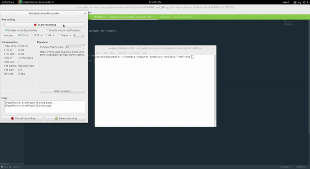

# README

## Pythagorean tree 

This is a way to draw a tree with branches using pentagons and triangles.

To run, 

> java -jar pythee jar <limit-DFS> <limit-BFS>

where limit-BFS must be integers.

### Output 

### Caveat

> You want to keep the clicks close together or the tree will draw outside the bounds of the window

